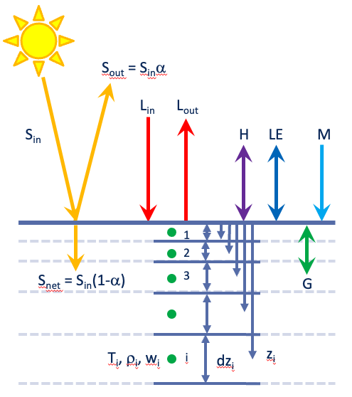

# IMAU-fortranEBM
**The IMAU fortran SEB model for snow and ice**
The fortran version of the IMAU surface energy balance model for snow or ice



### Fortran installation
Install a fortran compiler, e.g. Gfortran, part of the gnu compiler collection (gcc). 
On a Mac this can be done using a package manager such as Homebrew or MacPorts.

### Download the SEB model
In the terminal, navigate to a directory _INSTALLDIR_ of your choice.
```bash
cd INSTALLDIR
```

* For developpers (using git), clone the repository.
  In the terminal, run:
  ```bash
  git clone https://github.com/IMAU-ice-and-climate/IMAU-fortranEBM.git
  ```

* For users, download the [.zip file](https://github.com/IMAU-ice-and-climate/IMAU-fortranEBM/archive/refs/heads/main.zip) and unzip in _INSTALLDIR_:
  ```bash
  wget "https://github.com/IMAU-ice-and-climate/IMAU-fortranEBM/archive/refs/heads/main.zip"
  ```

### Preparing forcing and parameter files
Make sure that the directory structure is the following:
```
seb-model_fortran-main
├── Input
│   ├── ant_awsid
│   │   ├── ant_awsid_ebm.txt
│   │   ├── ant_awsid_HOUR-EBM.txt
├── Output
│   ├── ant_awsid
├── Scripts
├── Source
```
In the 'input' directory, there should be one folder per station. 
In each station folder, there should be 2 files:

* awsid_ebm.txt  (parameters) 

* awsid_HOUR-EBM.txt (atmospheric forcing)

Make sure that the output directory exists.

### Running the SEB model from the terminal
Go to the scripts directory in the sebmodel directory

```bash
cd seb-model_fortran-main/
cd Scripts/
```

Now, run the SEB model by running the run script:
```bash
./ebmmodel.sc -aws aws_antid
```
You can change the name of the station (aws_antid).
This script compiles the code and runs the code for station the mentioned station.
other options are
-m : only compile the code
-e exp : extra option to define different experiments. When set the output is stored in Output/station/exp/

If everything works, you should see the something like:

```bash
AWS name and region:  ant_awsid
 execute Makefile ... 
make: `ebmmodel.x' is up to date.
cp: ../Input/spectrum/*: No such file or directory
 execute model ... 

Read some useful coefficients 

Initialise all arrays to zero

-----------------------------------------------
START  2009


Read input data 

ilast =    8257, ilasttot =    8257, jdaystart =     21, jdaylast =    365
 END data checking, start EBM calculation

Initialise the subsurface grid
 initial number of layers is:           53          52  0.57773621681270626        24.711131891593645                1

Initialise the subsurface, temp and dens
 No snowdens profile initialisation function available for this site
 Set to constant value rhosninit and densfirn:    300.00000000000000        500.00000000000000     
   825   8257     10 % done of year      1      7
  1650   8257     20 % done of year      1      7
  2475   8257     30 % done of year      1      7
 
.
.
.
.

  8760   8760    100 % done of year      7      7

   1172.7325927879599       melt sum in mm w.e. (snow + ice/firn)
   25.857819190036874       runoff sum in mm w.e. (snow + ice/firn)
   3046.1448943619216       accumulation sum in mm w.e. (snow)
   0.0000000000000000       ice/firn melt (mm w.e.) (excluding fresh snow fall of this year).

       0.98942 pearsonR correlation coefficient T0 mod vs obs
       0.51962 standard deviation T0 diff mod - obs
       0.45690 average T0  bias        1.58622 average T0  RMSD (mod-obs)   57502.
      -0.17450 average smb bias        0.22648 average smb RMSD (mod-obs)   53399.
      -6.65551 average acc bias        6.82258 average acc RMSD (mod-obs)   53399.
       0.00000 average mel bias        0.00000 average mel RMSD (mod-obs)   53399.

advised time step below:    120


  Date 2015-12-31  Start summer  300.  Start winter  90.
  2015 Start day melt:  325.667 End day melt:  365.917
  2014  2015 Observed: Winter balance (m w.e.):     3.6588 Summer balance (m w.e.):     0.1587 Annual balance (m w.e.):     3.8175
  2014  2015 Modelled: Winter balance (m w.e.):     0.2612 Summer balance (m w.e.):     0.1631 Annual balance (m w.e.):     0.4243
  2014  2015 Modelled: Winter melt (m w.e.):        0.0000 Summer melt (m w.e.):        0.1507 Annual melt (m w.e.):        0.1507


THE END


real	0m15.995s
user	0m15.617s
sys	0m0.144s
total elapsed time
move output to /..../seb-model-fortran/Scripts/../Output/ant_awsid//
 model run finished  0
 script run finished
```

The output files are written in the 'output' folder:

```
seb-model_fortran-main
├── Input
│   ├── ant_awsid
│   │   ├── ant_awsid_ebm.py
│   │   ├── ant_awsid_HOUR-EBM.txt
├── Output
│   ├── ant_awsid
│   │   ├── ant_awsid_INFO.txt
│   │   ├── ant_awsid_AWS.txt
│   │   ├── ant_awsid_DAY.txt
│   │   ├── ...
│   │   ├── ...
├── Scripts
├── Source
```
The raw (hourly or 30min) output is stored in the 'ant_awsid_AWS.txt' file. 

The other files contain the same variables but averaged per day, month, seasonnaly or yearly. 

### Opening the output data

The output files are in plain txt format. 

### Additionnal information
A python version of this code is available from
https://github.com/imau-ice-and-climaten/IMAU-pyEBM

For similar SEB models, please check:

* COSIPY: https://github.com/cryotools/cosipy
* CryoGrid Community model: https://github.com/CryoGrid/CryoGridCommunity_source
* EB_AUTO Spreadsheet Energy Balance Model: https://github.com/atedstone/ebmodel
* Distributed Energy Balance Model : https://github.com/regine/meltmodel
* GEUS Surface Energy Balance and Firn Model: https://github.com/BaptisteVandecrux/SEB_Firn_model

If you have any questions, feel free to contact Carleen Reijmer, c.h.tijm-reijmer@uu.nl 
